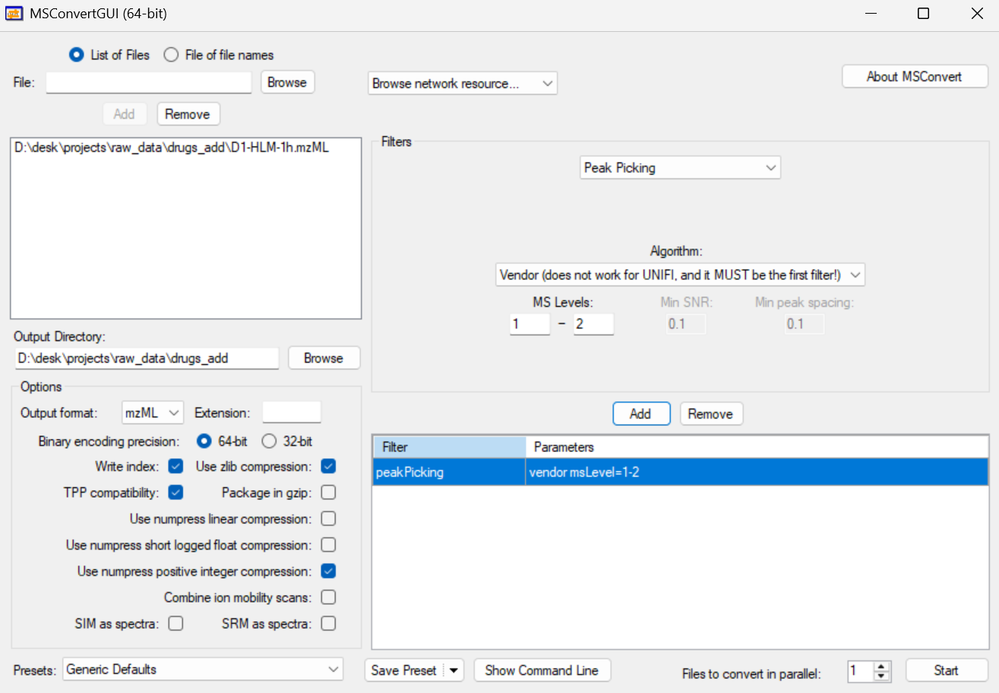
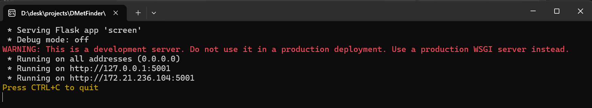

### Raw Data Preparation
1. Download the raw data from the github source or use your own LC-MS/MS data instead.

2. Convert the raw data to mzML or mzXML format using Proteowizard **MSConvert** tool (https://proteowizard.sourceforge.io/).
* Detailed convertion parameters are as follows:
 

### DMetFinder Usage
1. Download the release version of DMetFinder and unpack the dmetfinder.zip file.

2. Double click the **dmetfinder.exe** file to start the program.

3. Click the link shown in the terminal to open the web interface. Do not close the terminal window until you finish the analysis.
 

4. Upload raw data files and configure the analysis parameters.
* You can customize the analysis parameters in **Advanced** configs. Description of each parameter is provided in the **HELP.md** file.
* Finally, click **Submit Data** to start the analysis.
* The parameters circled in red are mandatory:
 

5. Wait for the analysis to complete. You can check the detailed logs in the terminal window.

6. Finally, the results will be displayed in the web interface.